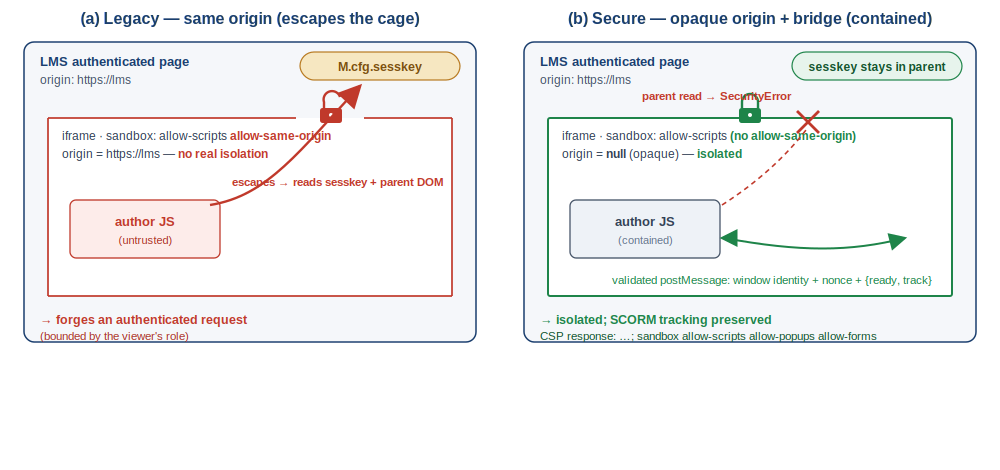

# El iframe que sabía demasiado — paper + PoC + evidencias

[](PAPER-CC-BY-4.0.md)
[](LICENSE)
[](https://github.com/erseco/lms-untrusted-content-security-paper/actions/workflows/preview-pdfs.yml)
[](REPRODUCIBILITY.md)
[](https://orcid.org/0009-0006-3817-1317)

**Aislamiento de JavaScript no confiable en recursos educativos.** Sistematización (SoK) y evaluación de seguridad —con artefactos reproducibles y evidencias empíricas documentadas— sobre el riesgo de **ejecutar HTML/JavaScript de
autor dentro de la sesión autenticada de un LMS/CMS** (Moodle, WordPress, Omeka S; SCORM, H5P,
eXeLearning). Incluye el artículo (ES + EN), una matriz comparativa con citas `archivo:línea`,
**PoC seguras** y los **resultados de laboratorio**.

*Ernesto Serrano Collado · Independent Researcher, Spain · ORCID:
[0009-0006-3817-1317](https://orcid.org/0009-0006-3817-1317) · info@ernesto.es*

> **Tesis:** el problema no es ejecutar JavaScript, sino ejecutarlo **con el mismo origen** que el
> LMS. Un modelo de **origen opaco + sandbox estricto + CSP + puente `postMessage` validado**
> mantiene la interactividad y el *tracking* SCORM sin confiar en el contenido como parte de la
> plataforma.

## Contenido

| Fichero | Qué es |
|---|---|
| [`seguridad-html-js-recursos-educativos.md`](seguridad-html-js-recursos-educativos.md) | **Artículo** (español, estructura IMRyD) |
| [`security-html-js-educational-resources.en.md`](security-html-js-educational-resources.en.md) | Versión en inglés |
| [`matriz-seguridad.md`](matriz-seguridad.md) | Matriz comparativa por plataforma (citas `archivo:línea`) + mitigaciones |
| [`anexos-tecnicos.md`](anexos-tecnicos.md) | Anexos: metodología, sonda *censurada*, resultados por plataforma/navegador |
| `references.bib` + `ieee.csl` | Referencias (BibTeX) + estilo IEEE |
| [`fuentes/`](fuentes/) | **Índice de fuentes por DOI/URL** (los PDF con copyright no se redistribuyen) |
| [`poc/`](poc/) | PoC seguras (`evil.elpx`, `evil.h5p`, `evil-h5p-library.h5p`, `evil-scorm.zip`, `evil-page*.html`) + `probe.js` + `build.sh` |
| [`evidencias/`](evidencias/) | Resultados de laboratorio (JSON), scripts de Playwright (Chromium/Firefox), tarjetas HTML |
| `generar-pdf.sh` | Genera localmente el PDF/DOCX del artículo, matriz, anexos e informe completo |
| [`REPRODUCIBILITY.md`](REPRODUCIBILITY.md) · `Makefile` | Cómo reproducir PoC, evidencias y PDF; objetivos `make` y sumas `pdf/SHA256SUMS` |

## Generar el PDF / DOCX

```bash
bash generar-pdf.sh           # DOCX + PDF de todo (pandoc -> tectonic)
bash generar-pdf.sh docx      # solo DOCX (rápido, solo pandoc)
```

Requiere `pandoc` y `tectonic` (`brew install pandoc tectonic`); no necesita TeX Live completo.
El PDF se genera en `pdf/` y el DOCX en `docx/`; ambos son artefactos locales no versionados.

## Hallazgos clave

- **`mod_page`**: **ejecuta** `<script>` del autor (`noclean=true`, sin saneamiento *server-side*); la
  protección es la **capacidad/rol** (`mod/page:addinstance`), no el filtrado.
- **SCORM nativo / `mod_exeweb` / `mod_exescorm`**: contenido del autor **same-origin**, sin sandbox.
- **H5P**: **no** ejecuta el HTML/JS de los *parámetros* (se filtran: control negativo), **pero** el
  `preloadedJs` de una **librería** es código de confianza que se ejecuta *same-origin* sin sandbox; la
  barrera es la capacidad `moodle/h5p:updatelibraries` (gestión/administración), no el saneamiento.
- **eXeLearning (Moodle/WordPress/Omeka S)**: **modo seguro de origen opaco propuesto** (propuesta de modificación de código; sandbox sin
  `allow-same-origin` + CSP + puente `postMessage` validado); `legacy` reabre el mismo origen.

## Diagrama



*Mismo origen (legacy): el iframe lee `M.cfg.sesskey` y el DOM padre. Modo seguro (origen opaco):
el acceso al padre lanza `SecurityError`; el *tracking* SCORM viaja por un puente `postMessage`
validado (identidad de ventana + nonce + lista cerrada de acciones), con el `sesskey` confinado en
el padre. Fuente vectorial en [`figures/secure-mode-architecture.svg`](figures/secure-mode-architecture.svg).*

## Cómo citar

Este repositorio incluye [`CITATION.cff`](CITATION.cff); GitHub mostrará el botón **“Cite this
repository”**. Resumen: *Serrano Collado, E. (2026). The iframe that knew too much: isolating untrusted JavaScript in educational resources…*
ORCID [0009-0006-3817-1317](https://orcid.org/0009-0006-3817-1317).

## Licencias

- **Texto del artículo y figuras** → **CC BY 4.0** (ver [`PAPER-CC-BY-4.0.md`](PAPER-CC-BY-4.0.md)).
- **Código** (PoC en `poc/`, scripts de evidencia en `evidencias/`, *scripts* de build) → **MIT**
  (ver [`LICENSE`](LICENSE)).
- Los **PDF de las fuentes** con derechos de autor **no** se redistribuyen; se enlazan por DOI/URL en
  [`fuentes/README.md`](fuentes/README.md).

## Asistencia de IA

Parte del texto, el código de las PoC y los *scripts* de evidencia se elaboraron con apoyo de
herramientas de IA generativa. **Todas** las afirmaciones técnicas, el código y las evidencias fueron
revisadas y verificadas por el autor, que asume la responsabilidad del contenido. Ver la
*"Declaración sobre el uso de IA generativa"* en el artículo.

## Seguridad y ética de esta investigación

PoC **inocuas** (solo booleanos + nombres de error *censurados*), entornos **locales y desechables**,
sin exfiltración ni endpoints externos. **La sonda distribuida (`probe.js`) no hace `POST`**; las
confirmaciones de impacto descritas en los anexos usaron `POST` reales **autorizados y reversibles**
sobre cuentas propias/de laboratorio (nunca destructivos ni en producción). Los comportamientos
descritos son, en su mayoría, **documentados y por diseño** (no *0-day* de terceros). Sin *payloads* reutilizables ni
pasos de abuso. Detalle en la sección 8 (Ética) del artículo y en `anexos-tecnicos.md`. El autor contribuye a
varias de las piezas evaluadas (declaración de conflicto de interés en la sección 9 del artículo).
